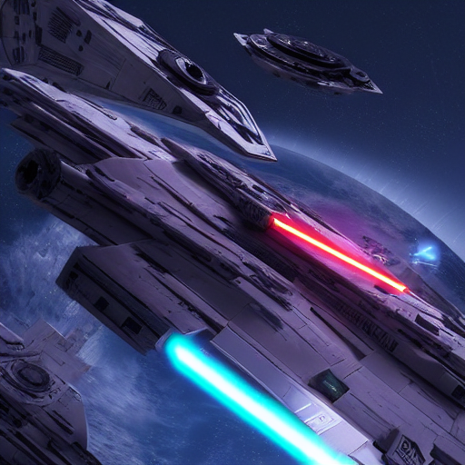
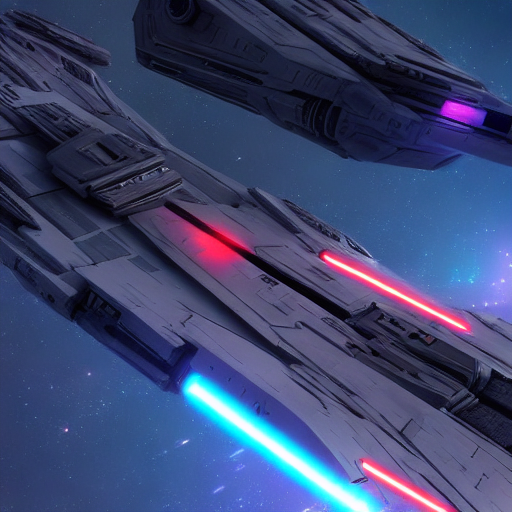
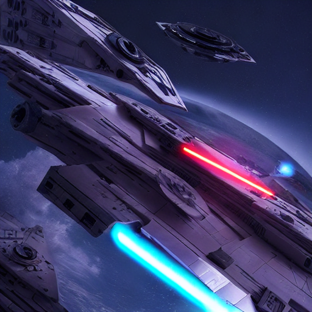

# Text-to-Image and Image-to-Image Generation using Stable Diffusion

## Introduction

This project aims to generate images from text prompts and images using the Stable Diffusion technique. The Stable Diffusion technique is a state-of-the-art method for image generation, which uses a "diffusion process" to generate images. 
The diffusion process represents taking an image with noise added on it, then removing part of the noise step by step, in a controlled manner, until an image is generated.

The project uses a pre-trained model to generate images from text prompts and images, and provides an extensive control over the generation process.

## Overview

The project uses the Stable Diffusion technique with a Classifier-free Guidance approach to generate images from text prompts and images. It consists of the following components:

- Text-to-Image Generation: The project generates images based on text prompts.
- Image-to-Image Generation: The project generates similar images based on given images.

In both cases, the project manually controls the diffusion process through its components, providing a more extensive control over the generation process and an in-depth illustration of the technique.

## Text-to-Image Generation

The text-to-image generation process consists of the following steps:

1. Convert the given text prompt into text embeddings using the tokenizer.
2. Embeddings, along with the noise, are sent to the UNet model.
3. The UNet model performs the backward diffusion process, removing noise step by step, obtaining latents for the final image. Here, the Classifier-free Guidance approach is used.
4. These image latents are then decoded by the VAE model to generate the final image.

## Image-to-Image Generation

The process of image-to-image generation is similar to the text-to-image generation, with the following steps:

1. Convert the given image into image embeddings using the VAE model.
2. Embeddings, along with the noise, are sent to the UNet model.
3. The UNet model performs the backward diffusion process, removing noise step by step, obtaining latents for the final image. Here, the Classifier-free Guidance approach is used.
4. These image latents are then decoded by the VAE model to generate the final image.

## Model Architecture

The model architecture is based on the Stable Diffusion technique, with a Classifier-free Guidance approach, which is the state-of-the-art method for image generation. The model consists of 4 components: an autoencoder, a text encoder and its tokenizer, a UNet model, and a scheduler:

- Variational Autoencoder (VAE): The VAE is used to encode and decode images. It consists of an encoder and a decoder, which are used to encode images into latent space and decode them back to the original image. The VAE used here is the pre-trained `AutoencoderKL` model from the `diffusers` library.
- The Text Encoder and Tokenizer: The text encoder is used to encode text prompts into latent space. The tokenizer is used to convert text into tokens, which are then fed into the text encoder. The text encoder used here is the pre-trained `CLIPTextModel` model, while the tokenizer is the pre-trained `CLIPTokenizer` model, both from the `transformers` library. 
- UNet Model: The UNet model is used to generate images from the encoded text and image latent spaces, being useful in the denoising of the respective latent image representations. It works similarly to an autoencoder, but is also has skip connections, helping in the process of propagating features found in the corresponding previous layer. The UNet model used here is the pre-trained `UNet2DConditionModel` model from the `diffusers` library.
- Scheduler: The scheduler is used to control the diffusion process, controlling the number of steps, as well as the step size, the amount of noise added and the manner it is added. The schedulers used here are the pre-trained `LMSDiscreteScheduler` and `DDIMScheduler` schedulers from the `diffusers` library.

## Results

The results of the project can be found in the `generated_images` folder. The images are generated from given text prompts or images. They have 512x512 resolution and are saved in PNG format.

### Examples of generated images

| Image 1                                                  | Image 2                                                   | Image 3                                                   |
|----------------------------------------------------------|-----------------------------------------------------------|-----------------------------------------------------------|
|  |  |  |
| Text-to-Image                                            | Image-to-Image (10 steps, given Image 1)                  | Image-to-Image (40 steps, given Image 1)                               |

The first image was generated using the prompt "Aesthetic star wars spaceship with an aesthetic background, Ultra HD, futuristic, sharp, octane render, neon", while the other two images were generated from the first image using the diffusion technique. The second image was generated after 10 steps, while the third image was generated after 40 steps.

## Conclusion

This project successfully implements a method for generating images from text prompts, as well as from images.
It uses the Stable Diffusion technique, which represents the state-of-the-art for image generation, while having an extensive control over the process. 

The results highlight the potential of combining computer vision with natural language processing to create compelling visual content.

## References

- https://thepythoncode.com/article/generate-images-from-text-stable-diffusion-python
